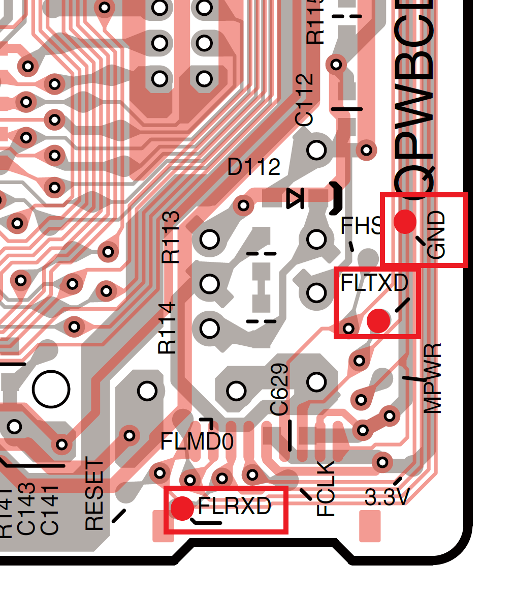

## UART-Testpunkte

    
     
    <em>UART-Testpunkte am Mainboard

Die UART-Verbindung erfolgt direkt über die Testpunkte auf dem Mainboard:

- RXD → ESP8266 GPIO1 / TX
- TXD → ESP8266 GPIO3 / RX
- GND → ESP8266 GND

## ESP8266 Stromversorgung

Die Stromversorgung erfolgt durch den USB-Anschluss des WEMOS D1 Mini.
Interne Stromversorung durch den Onkyo nicht möglich. Getestet wurden +12VD_ST und +10VS die im Standby verfügbar sind. Jedoch nicht genügend Stromlieferfähigkeit, mit ESP8266 über Buck Converter LM2596 angeschlossen sinkt die Spannung auf ~5V und der Reciever lässt sich nicht einschalten.